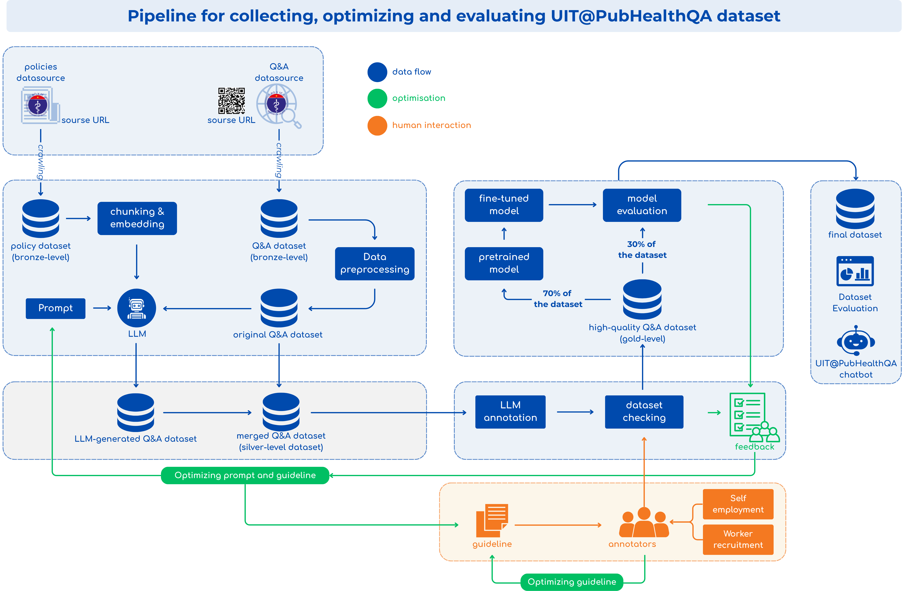
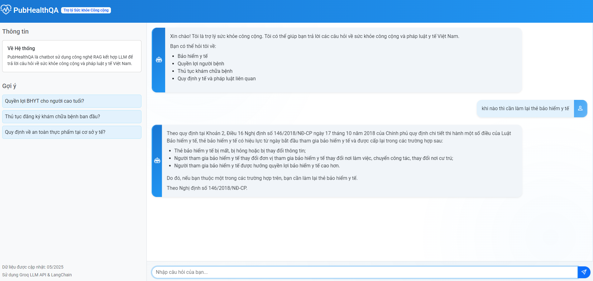

# 🩺 [UIT@PubHealthQA] HCM Public Health Office Procedure Q&A Dataset

<!---
--->
<div align="center">
  
</div>

[](https://opensource.org/licenses/MIT)
[](https://www.python.org/downloads/)

## 📑 Table of Contents
- [Overview](#-overview)
- [Key Features](#-key-features)
- [Dataset Structure](#-dataset-structure)
- [System Architecture](#-system-architecture)
- [Installation](#-installation)
- [Usage](#-usage)
- [Project Structure](#-project-structure)
- [Acknowledgements](#-acknowledgements)
- [License](#-license)

## 🧾 Overview
The **HCM Public Health Office Procedure Q&A Dataset** - `UIT@PubHealthQA` is a multi-tiered dataset project focused on building a high-quality Question Answering (QA) dataset in the public health domain, using a combination of document crawling, structured text extraction, and LLM+RAG-based question generation.

The dataset includes real-world public health inquiries submitted by citizens and corresponding expert responses provided by official sources. Each entry typically contains:
- A user-submitted question (in Vietnamese)
- An official answer provided by the local health department or relevant authority
- Metadata such as category, timestamp, and location (where applicable)

This project aims to:
- Make public health regulations accessible to Vietnamese citizens
- Ensure information accuracy through grounding responses in official legal documents
- Provide a scalable framework for domain-specific question answering in Vietnamese

## ✨ Key Features

- **Vietnamese-centric RAG System**: Built specifically for Vietnamese language public health documents
- **Multi-tiered Data Processing Pipeline**: Comprehensive bronze → silver → gold data refinement
- **Diverse Document Sources**: Includes laws, decrees, circulars, and official communications
- **Interactive Web Interface**: User-friendly chat interface with citation sources
- **Bloom Taxonomy-based Questions**: Educational Q&A content organized by cognitive complexity
- **Vector Database**: Efficient FAISS-based vector store for semantic search
- **LLM Integration**: Leverages GROQ's high-performance language models

## 📊 Dataset Structure

We adopt a Bronze–Silver–Gold data quality framework:

| Tier | Description |
|------|-------------|
| 🥉 **Bronze** | Raw crawled data from official public health sources, minimally processed |
| 🥈 **Silver** | Cleaned, structured data with consistent formatting and metadata |
| 🥇 **Gold** | Vector database with optimized chunks for retrieval and validated Q&A pairs,QA pairs  |

## 🏗 System Architecture

The UIT@PubHealthQA system is built as a modular pipeline:
<div align="center">
  
</div>

1. **Data Acquisition** - Collecting data from official sources
2. **Preprocessing** - Cleaning and structuring documents
3. **Chunking & Vectorization** - Creating searchable document segments
4. **Retrieval** - Finding relevant content based on user queries
5. **Generation** - Producing accurate, contextual answers with citations

The architecture employs several optimizations:
- Smart chunking strategies based on document structure
- Hybrid retrieval combining semantic and keyword search
- Context-aware response generation with source attribution

## 🔧 Installation

### Prerequisites
- Python 3.8+
- Git
- GROQ API key (for LLM access)

### Setup

1. Clone the repository:
   ```bash
   git clone https://github.com/nguyenlong205/uit.PubHealthQA.git
   cd uit.PubHealthQA
   ```

2. Create and activate a virtual environment (optional but recommended):
   ```bash
   python -m venv venv
   # On Windows
   venv\Scripts\activate
   # On macOS/Linux
   source venv/bin/activate
   ```

3. Install dependencies:
   ```bash
   pip install -r requirements.txt
   ```

4. Set up your GROQ API key:
   ```bash
   python setup_groq_key.py
   ```

5. Download or prepare the necessary data:
   ```bash
   # Create required directories
   mkdir -p data/bronze data/silver data/gold logs/question_generation
   ```

## 🚀 Usage

### Data Processing Pipeline

The project follows a sequential pipeline approach:

1. **Data Collection**:
   ```bash
   python src/01-pipeline_ingestingPolicy.py
   python src/01-pipeline_ingestingQAPair.py
   ```

2. **Data Preprocessing**:
   ```bash
   python src/02-pipeline_preprocessing.py
   ```

3. **Vector Database Creation**:
   ```bash
   python src/02-pipeline_vectorDB.py
   ```

4. **Question Generation** (optional):
   ```bash
   python src/03-pipeline_generatingQuestion.py
   ```

### Running the Web Interface

Launch the interactive QA chatbot:

```bash
python app.py
```

Then open your browser and navigate to `http://localhost:8000`
This is a Demo for system:

## 🗂️ Project Structure

```
UIT@PubHealthQA/
│
├── app/                           # Web application files
│   ├── static/                    # CSS, JavaScript, and images
│   └── templates/                 # HTML templates
│
├── data/                          # Dataset files organized by processing stage
│   ├── bronze/                    # Raw crawled data
│   │   ├── raw_QAPair.csv         # Raw QA pairs from Ministry of Health
│   │   └── raw_Policy.json        # Raw policy documents
│   ├── silver/                    # Cleaned and structured data
│   │   └── Policy.json            # Cleaned policy documents
│   │   
│   └── gold/                      # Vector databases and embeddings
│       ├── db_faiss_phapluat_yte/ # FAISS vector store
│       └──QAPair.csv              #
├── logs/                          # Log files and generated outputs
│   └── question_generation/       # Generated QA pairs
│
├── notebooks/                     # Jupyter notebooks for exploration
│   ├── 01-exploration.ipynb
│   └── 02-cleaning-transform.ipynb
│
├── src/                           # Source code
│   ├── data_acquisition/          # Data collection modules
│   ├── preprocessing/             # Text cleaning and processing
│   │   ├── document_processor.py  # Document cleaning utilities
│   │   ├── text_splitter.py       # Text chunking utilities 
│   │   └── chunking.py            # Chunking strategies
│   ├── utils/                     # Utility functions
│   ├── vector_store/              # Vector database management
│   ├── 01-pipeline_ingestingPolicy.py    # Data collection pipeline
│   ├── 01-pipeline_ingestingQAPair.py    # QA pair collection pipeline
│   ├── 02-pipeline_preprocessing.py      # Data cleaning pipeline
│   ├── 02-pipeline_vectorDB.py           # Vector database creation pipeline
│   └── 03-pipeline_generatingQuestion.py # QA generation pipeline
│
├── tests/                         # Unit and integration tests
├── app.py                         # Main web application
├── requirements.txt               # Python dependencies
├── setup_groq_key.py              # API key setup utility
└── README.md                      # This documentation
```

## 🙏 Acknowledgements

We extend our sincere gratitude to:

**Academic Advisors:**
- Ph.D. Nguyen Gia Tuan Anh – University of Information Technology, VNUHCM
- Ph.D. Duong Ngoc Hao - University of Information Technology, VNUHCM
- T.A. Tran Quoc Khanh – University of Information Technology, VNUHCM

**Development Team:**
- Dung Ho Tan, 23520327@gm.uit.edu.vn
- An Pham Dang, 22520027@gm.uit.edu.vn

We also acknowledge the support of:
- GROQ for providing advanced language model access

## 📄 License

This project is licensed under the MIT License - see the LICENSE file for details.
